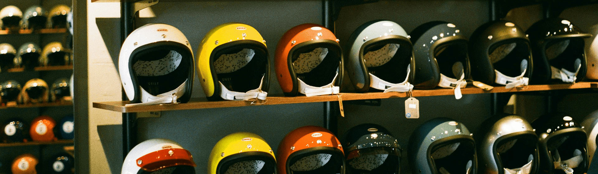
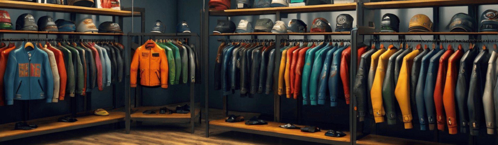

# 🏍️ Asphalt Brothers - Motorcycle Store

Modern e-commerce store for motorcycle accessories 🏁 built with Next.js, TypeScript and Prisma. 🛒

## 🚀 Live Demo

Check out the live application: **[https://asphalt.armast.pl](https://asphalt.armast.pl)**

> ⚠️ **Work in Progress:** This project is still under development and not in its final version. Features may be incomplete or subject to change.

## 📸 Screenshots





## 🛠 Tech Stack

- **Frontend:** Next.js 15, React 19, TypeScript
- **Styling:** Tailwind CSS, Shadcn UI
- **Backend:** Next.js API Routes
- **Database:** Prisma ORM, Neon Database Serverless
- **Authentication:** NextAuth.js
- **Payments:** PayPal React SDK
- **Forms:** React Hook Form, Zod validation
- **UI Components:** Shadcn UI
- **Theme:** Next Themes
- **Notifications:** Sonner (Toast notifications)
- **Testing:** Jest
- **Build Tools:** ESLint, PostCSS

## 👤 Test Account

For testing purposes, a demo user account is pre-configured in the database. You can also create your own account using the sign-up functionality to test the full user experience.

## Getting Started

First, run the development server:

```bash
npm run dev
# or
yarn dev
# or
pnpm dev
# or
bun dev
```

Open [http://localhost:3000](http://localhost:3000) with your browser to see the result.

## Learn More

To learn more about Next.js, take a look at the following resources:

- [Next.js Documentation](https://nextjs.org/docs) - learn about Next.js features and API.
- [Learn Next.js](https://nextjs.org/learn) - an interactive Next.js tutorial.
